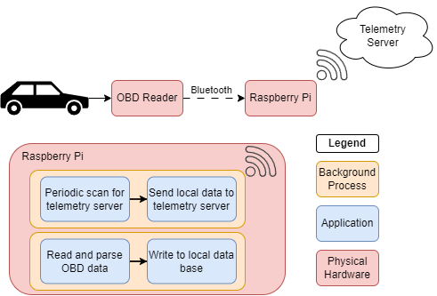
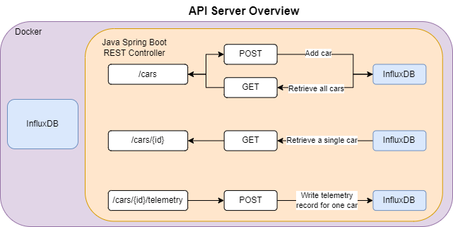

# Pi-Drive

Car data logging stack with raspberry pi collection front end and Java Spring Boot API backend. Every vehical sold in the US since 1996 is required to support the OBD-II protocol. OBD-II is focused on providing emissions data and exposes things like fuel consumption, coolant temperature, vehical speed, engine RPM, etc. This data can be useful for gaining an insight into your cars performance, especially if you have an older car like mine with the check engine light stuck on. The goal of this project is to record as much OBD data as I can and then visualize it in Grafana. I'm not a car guy and I'm not interested in tuning or getting max performance out of my car. I simply want to monitor its health and properly maintain it. Cars are expensive!

## Techologies Used

- Java Spring Boot
- RESTFul API
- [InfluxDB](https://www.influxdata.com/) (Timeseries SQL database)
- Docker
- [Grafana](https://grafana.com/grafana/) (Visualization)
- Python
- [OBD-II](https://www.csselectronics.com/pages/obd2-explained-simple-intro)

# Overview
The data collection is handeled by a bluetooth OBD reader and a raspberry pi. When powered on the pi continously checks for the bluetooth dongle and, if present, reads data from it. The data is then written to a local database on the pi. Also while powered on, another process is continously checking if I'm connected to my home wifi. If I am connected to my wifi then this process will ask my telemetry server what was the timestamp of the last piece of data it received. If the timestamp for the latest data on the local raspberry pi database is more recent than the timestamp of the telemetry server then the raspberry pi will send telemetry records one at a time to the telemetry server. This is nice because if the pi looses connection to the telemetry server (e.g I drive my car somewhere else) then the pi will pick up where it left off the next time its within range of my wifi.  
  
The telemetry server is a simple RESTful API written in Java using the Spring Boot framework. It only has two core jobs: receive telemetry data and write telemetry data to InfluxDB. Before telemetry data can be received the server must be told about the existance of a car via the `/cars` endpoint. After the server is told about a car a unique ID is generated and telemetry data can be sent to the server via the `/cars/{id}/telemetry` endpoint. The check what cars exist and find their ids the `/cars` endpoint can be queried.  



# Repository Structure

```
.github/workflows/ (github actions workflow for building jar file and pushing docker image)
rasp-pi/ (Ansible playbook and application files to configure raspberry-pi for data logging)
server/ (software stack for collecting and monitoring car telemetry from raspberry-pi)
.gitignore
LICENSE
README.md
```

# Setup

## Physical Hardware Requirements

- Raspberry Pi
  - I'm using a model 3. Other models would work fine too.
- [OBD reader](https://www.obdlink.com/products/obdlink-lx/)
  - Cheaper OBD readers exist but I wanted some of the other features this supports. Specifically the raw CAN dump feature.
  
## Software Requirements

Requirments for software on the computer you are using to setup your pi and server.

- [Ansible](https://docs.ansible.com/ansible/latest/installation_guide/intro_installation.html)
- [Docker](https://docs.docker.com/engine/install/)

If you would like to edit the source code there are additional requirements.

<details>
<summary>Developer Requirements</summary>

- Java 23
- VScode with the following extensions
  - [Spring Boot Extension Pack](https://marketplace.visualstudio.com/items?itemName=vmware.vscode-boot-dev-pack)
  - [Java Developor Pack](https://marketplace.visualstudio.com/items?itemName=vscjava.vscode-java-pack)

</details>

## Raspberry Pi Setup

I'm going to lightly gloss over the pi setup since this is not intended to be a tutorial on the raspberry pi. If you have any questions though feel free to reach out.

### Create a bootable SD card for your raspberry pi

- The [pi imager](https://www.raspberrypi.com/software/) tool from the raspberry pi foundation makes this pretty easy. I installed raspian lite because the GUI is not needed for this project.
  - Create your user account
  - Configure the pi to connect to your wifi.
  - Configure the pi to enable ssh and setup ssh-keys
  - This can be done through the customize os option in pi imager

### Install project software and tools onto pi

`ansible-playbook -i ./rasp-pi/ansible/inventory.ini ./rasp-pi/ansible/configure-pi.yaml `

## Server Setup

If you are editing the source code then you should follow these additional steps first.

<details>

<summary>Developer steps</summary>

Running the following commands will package any edits you've made to the source code into a jar file and then build a new docker container with the update jar file.

```
cd server/server
./gradlew clean bootjar
docker build . -t telemetry-server
```

edit the docker compose file to use your new docker image.

</details>

1. `cd server` and then `docker-compose -f sample-docker-compose.yml up`

2. Navitage to the influxdb setup page at localhost:8086 and configure your influxdb username, password, organization, and bucket.

3. Edit the environment variables in the pidrive-server of `sample-docker-compose.yml` to match the configuration you made in step 2.

4. create a influxdb_token.txt file and paste your influxdb api token.

5. stop and restart your docker containers!


### Debugging Commands

- `curl -X POST 127.0.0.1:8080/cars -H 'Content-type:application/json' -d '{"make": "Honda", "model": "year", year: 2007}'`
- `curl -X POST 127.0.0.1:8080/cars -H 'Content-type:application/json' -d  @./server/sample-api-telemetry.json`
  

### Notes and TODO

These are notes to myself.

- I could have the telemetry script open a socket
  - whenever a new telemetry script is spawned it checks this socket to see if the previous one is still alive
  - if the previous telemtry script is unresponive then the new script will kill the old one and picked up where the old script left off
  - The goal here being to prevent a script crashing from preventing anymore data from being sent to the server
  - This is a later feature / issue to worry about, however
  - For now, our telemetry script will simply check to see if the process already exist and then exit if it does
- Sanitize user input from the API. E.g make user input uniform case, check for escaped characters or sql injection?
- check that objects exist or dont exist in the data base where appropiate
- How to handle power draw of raspberry pi? Once the telemtry server is caught up with the pi have the pi turn off. If the telemetry server is not found within X minutes, turn the pi off?

# Useful Resources

- [HTTP 1.1 standard](https://www.ietf.org/rfc/rfc2616.txt) lays out the definition and uses of GET, POST, PUT, and delete
- [REST APIS vs RPC](https://roy.gbiv.com/untangled/2008/rest-apis-must-be-hypertext-driven) What actually makes something RESTful? Using HTTP request is not enough
- [Hypertext Application Language (HAL)](https://stateless.co/hal_specification.html) how to navigate hyperlink resources in an API
- [Getting started with spring RESTful API](https://spring.io/guides/tutorials/rest) a pretty indepth guide at setting up spring to serve a RESTful API
- [InfluxDB data point](https://docs.influxdata.com/influxdb/v2/reference/key-concepts/data-elements/#Copyright) how data is stored in InfluxDB
  - [How you should design a schema](https://docs.influxdata.com/influxdb/v2/write-data/best-practices/schema-design/)
  - [High Series Cardinality](https://docs.influxdata.com/influxdb/v2/write-data/best-practices/resolve-high-cardinality/) How and why to avoid high series cardinality
