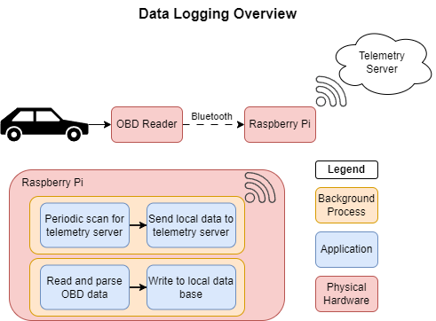

# Pi-Drive

RasberryPi based car logging and telemetry software



# Repository Structure

```
.github/workflows/ (github actions workflow for building jar file and pushing docker image)
rasp-pi/ (Ansible playbook and application files to configure raspberry-pi for data logging)
server/ (software stack for collecting and monitoring car telemetry from raspberry-pi)
.gitignore
LICENSE
README.md
```

# Setup

## Equipment Requirements

- Raspberry Pi
  - I'm using a model 3. Other models would work fine too.
- [OBD reader](https://www.obdlink.com/products/obdlink-lx/)
  - Cheaper OBD readers exist but I wanted some of the other features this supports. Specifically the raw CAN dump feature.
  
## Software Requirements

Requirments for software on the computer you are using to setup your pi and server.

- [Ansible](https://docs.ansible.com/ansible/latest/installation_guide/intro_installation.html)
- Docker

If you would like to edit the source code there are additional requirements.

<details>
<summary>Developer Requirements</summary>

- Java 23
- VScode with the following extensions
  - [Spring Boot Extension Pack](https://marketplace.visualstudio.com/items?itemName=vmware.vscode-boot-dev-pack)
  - [Java Developor Pack](https://marketplace.visualstudio.com/items?itemName=vscjava.vscode-java-pack)

</details>

## Raspberry Pi Setup

I'm going to lightly gloss over the pi setup since this is not intended to be a tutorial on the raspberry pi. If you have any questions though feel free to reach out.

### Create a bootable SD card for your raspberry pi

- The [pi imager](https://www.raspberrypi.com/software/) tool from the raspberry pi foundation makes this pretty easy. I installed raspian lite because the GUI is not needed for this project.
  - Create your user account
  - Configure the pi to connect to your wifi.
  - Configure the pi to enable ssh and setup ssh-keys
  - This can be done through the customize os option in pi imager

### Install project software and tools onto pi

`ansible-playbook -i ./rasp-pi/ansible/inventory.ini ./rasp-pi/ansible/configure-pi.yaml `

## Server Setup

If you are editing the source code then you should follow these additional steps first.

<details>

<summary>Developer steps</summary>

Running the following commands will package any edits you've made to the source code into a jar file and then build a new docker container with the update jar file.

```
cd server/server
./gradlew clean bootjar
docker build . -t telemetry-server
```

</details>

### Debugging Commands

- `curl -X POST 127.0.0.1:8080/cars -H 'Content-type:application/json' -d '{"make": "Honda", "model": "year", year: 2007}'`
- `curl -X POST 127.0.0.1:8080/cars -H 'Content-type:application/json' -d  @./server/sample-api-telemetry.json`
  

### Notes and TODO

These are notes to myself.

- I could have the telemetry script open a socket
  - whenever a new telemetry script is spawned it checks this socket to see if the previous one is still alive
  - if the previous telemtry script is unresponive then the new script will kill the old one and picked up where the old script left off
  - The goal here being to prevent a script crashing from preventing anymore data from being sent to the server
  - This is a later feature / issue to worry about, however
  - For now, our telemetry script will simply check to see if the process already exist and then exit if it does
  - Sanitize user input from the API. E.g make user input uniform case, check for escaped characters or sql injection?
  - check that objects exist or dont exist in the data base where appropiate

# Useful Resources

- [HTTP 1.1 standard](https://www.ietf.org/rfc/rfc2616.txt) lays out the definition and uses of GET, POST, PUT, and delete
- [REST APIS vs RPC](https://roy.gbiv.com/untangled/2008/rest-apis-must-be-hypertext-driven) What actually makes something RESTful? Using HTTP request is not enough
- [Hypertext Application Language (HAL)](https://stateless.co/hal_specification.html) how to navigate hyperlink resources in an API
- [Getting started with spring RESTful API](https://spring.io/guides/tutorials/rest) a pretty indepth guide at setting up spring to serve a RESTful API
- [InfluxDB data point](https://docs.influxdata.com/influxdb/v2/reference/key-concepts/data-elements/#Copyright) how data is stored in InfluxDB
  - [How you should design a schema](https://docs.influxdata.com/influxdb/v2/write-data/best-practices/schema-design/)
  - [High Series Cardinality](https://docs.influxdata.com/influxdb/v2/write-data/best-practices/resolve-high-cardinality/) How and why to avoid high series cardinality
